# Vector Architecture

## System Overview

Vector is an **Issue-Conditioned Discovery & Ranking System** designed for influencer audience identification and analysis. The system processes social media data to discover, score, and export influencer audiences by specific issues.

## Technical Architecture Diagram

```mermaid
graph TB
    %% Data Sources
    subgraph "Data Sources"
        CSV[CSV/Parquet/JSON Files]
        GDELT[GDELT API<br/>Global News & Events]
        REDDIT[Reddit API<br/>Social Media Posts]
        CUSTOM[Custom APIs<br/>Extensible Adapters]
    end

    %% Data Ingestion Layer
    subgraph "Data Ingestion Layer"
        ADAPTERS[Data Adapters<br/>load_users, load_edges, load_posts]
        GDELT_ADAPTER[GDELT Adapter<br/>News & Events Processing]
        REDDIT_ADAPTER[Reddit Adapter<br/>Posts & Comments Processing]
    end

    %% Core Processing Pipeline
    subgraph "Core Processing Pipeline"
        PIPELINE[Main Pipeline<br/>pipeline.py]
        
        subgraph "NLP Processing"
            TAXONOMY[Taxonomy Loader<br/>Issue Classification]
            TAGGER[Post Tagger<br/>Issue Labeling]
            STATS[User Issue Stats<br/>Engagement Analysis]
        end
        
        subgraph "Graph Analysis"
            GRAPH[Graph Builder<br/>NetworkX]
            PAGERANK[PageRank Calculator<br/>Centrality Analysis]
            COMMUNITIES[Community Detection<br/>Graph Clustering]
        end
        
        subgraph "Scoring Engine"
            SCORER[Multi-Factor Scorer<br/>Reach + Engagement + Centrality + Salience]
            WEIGHTS[Configurable Weights<br/>default.yaml]
        end
    end

    %% Plugin System
    subgraph "Plugin System"
        PLUGIN_BASE[Base Plugin Interface<br/>Protocols]
        KEYWORD_PLUGIN[Keyword Plugin<br/>TF-IDF Fallback]
        LINEAR_PLUGIN[Linear Scorer Plugin<br/>Weighted Scoring]
        PAGERANK_PLUGIN[PageRank Plugin<br/>Centrality Calculation]
        SELECTOR_PLUGIN[Selector Plugin<br/>Diversity-Aware Selection]
    end

    %% Compliance & Safety
    subgraph "Compliance & Safety"
        POLICIES[Compliance Policies<br/>Political Restriction Checks]
        GUARDRAILS[Brand Safety<br/>Keyword Screening]
        DIVERSITY[Diversity Constraints<br/>Community-Aware Selection]
    end

    %% Output Generation
    subgraph "Output Generation"
        RANKING[Issue Ranking<br/>Top-K Influencers]
        AUDIENCE[Audience Export<br/>Follower Networks]
        STATE[State Persistence<br/>JSON State File]
    end

    %% Interface Layer
    subgraph "Interface Layer"
        CLI[Command Line Interface<br/>Typer CLI]
        API[FastAPI Web Service<br/>REST Endpoints]
        CONFIG[Configuration Management<br/>YAML Config]
    end

    %% Data Flow Connections
    CSV --> ADAPTERS
    GDELT --> GDELT_ADAPTER
    REDDIT --> REDDIT_ADAPTER
    CUSTOM --> ADAPTERS
    
    ADAPTERS --> PIPELINE
    GDELT_ADAPTER --> PIPELINE
    REDDIT_ADAPTER --> PIPELINE
    
    PIPELINE --> TAXONOMY
    PIPELINE --> TAGGER
    PIPELINE --> GRAPH
    
    TAXONOMY --> TAGGER
    TAGGER --> STATS
    
    GRAPH --> PAGERANK
    GRAPH --> COMMUNITIES
    
    STATS --> SCORER
    PAGERANK --> SCORER
    COMMUNITIES --> SCORER
    WEIGHTS --> SCORER
    
    SCORER --> RANKING
    RANKING --> AUDIENCE
    PIPELINE --> STATE
    
    POLICIES --> PIPELINE
    GUARDRAILS --> PIPELINE
    DIVERSITY --> RANKING
    
    PLUGIN_BASE --> TAGGER
    PLUGIN_BASE --> PAGERANK
    PLUGIN_BASE --> SCORER
    PLUGIN_BASE --> RANKING
    
    KEYWORD_PLUGIN --> TAGGER
    LINEAR_PLUGIN --> SCORER
    PAGERANK_PLUGIN --> PAGERANK
    SELECTOR_PLUGIN --> RANKING
    
    CONFIG --> PIPELINE
    CLI --> PIPELINE
    API --> PIPELINE
    CLI --> RANKING
    API --> RANKING
    CLI --> AUDIENCE
    API --> AUDIENCE

    %% Styling
    classDef dataSource fill:#e1f5fe
    classDef processing fill:#f3e5f5
    classDef plugin fill:#fff3e0
    classDef compliance fill:#ffebee
    classDef output fill:#e8f5e8
    classDef interface fill:#fce4ec

    class CSV,GDELT,REDDIT,CUSTOM dataSource
    class PIPELINE,TAXONOMY,TAGGER,STATS,GRAPH,PAGERANK,COMMUNITIES,SCORER processing
    class PLUGIN_BASE,KEYWORD_PLUGIN,LINEAR_PLUGIN,PAGERANK_PLUGIN,SELECTOR_PLUGIN plugin
    class POLICIES,GUARDRAILS,DIVERSITY compliance
    class RANKING,AUDIENCE,STATE output
    class CLI,API,CONFIG interface
```



## Data Flow Architecture


## Component Details

### 1. Data Ingestion Layer
- **Adapters**: Standardized data loading for CSV/Parquet/JSON
- **GDELT Integration**: Global news and events data processing
- **Reddit Integration**: Social media posts and comments processing
- **Extensible Design**: Plugin-based adapter system for new data sources

### 2. Core Processing Pipeline
- **NLP Processing**: Issue classification using keyword taxonomy and TF-IDF
- **Graph Analysis**: Social network analysis with PageRank and community detection
- **Scoring Engine**: Multi-factor scoring combining reach, engagement, centrality, and salience

### 3. Plugin System
- **Protocol-based**: Type-safe plugin interfaces
- **Extensible**: Easy addition of new algorithms
- **Configurable**: Runtime plugin selection via configuration

### 4. Compliance & Safety
- **Political Restrictions**: Built-in guardrails against political persuasion
- **Brand Safety**: Keyword screening and allowlist/denylist support
- **Diversity Constraints**: Community-aware selection to avoid echo chambers

### 5. Interface Layer
- **CLI**: Typer-based command-line interface
- **API**: FastAPI web service with REST endpoints
- **Configuration**: YAML-based configuration management

## Scoring Formula

The system uses a weighted multi-factor scoring approach:

```
score = w1·Reach + w2·EngagementRate(issue) + w3·PageRank + w4·IssueSalience(issue)
```

Where:
- **Reach**: Normalized follower count
- **Engagement Rate**: Issue-specific engagement per follower
- **PageRank**: Graph centrality measure
- **Issue Salience**: Proportion of user's content about the issue

Default weights (configurable):
- Reach: 35%
- Engagement: 25%
- Centrality: 25%
- Salience: 15%

## Data Contracts

### Input Data Formats
- **users.csv**: `user_id,handle,followers,following,geo,lang,profession`
- **edges.csv**: `src_user_id,dst_user_id` (directed follower graph)
- **posts.csv**: `post_id,user_id,text,likes,shares,comments,ts`
- **taxonomy.yaml**: Issue → keyword mappings

### Output Data Formats
- **issue_scores.csv**: User scores by issue with component breakdowns
- **state.json**: Complete pipeline state for subsequent operations
- **audience.csv**: Exported audience members for selected influencers

## Deployment Architecture


## Technology Stack

- **Core**: Python 3.8+, pandas, numpy, pydantic
- **Graph Analysis**: NetworkX, scikit-learn
- **Web Framework**: FastAPI, uvicorn
- **CLI**: Typer
- **Configuration**: PyYAML
- **Data Sources**: requests, praw (Reddit), python-dateutil
- **Development**: pytest, black, isort, flake8, mypy
- **Containerization**: Docker
